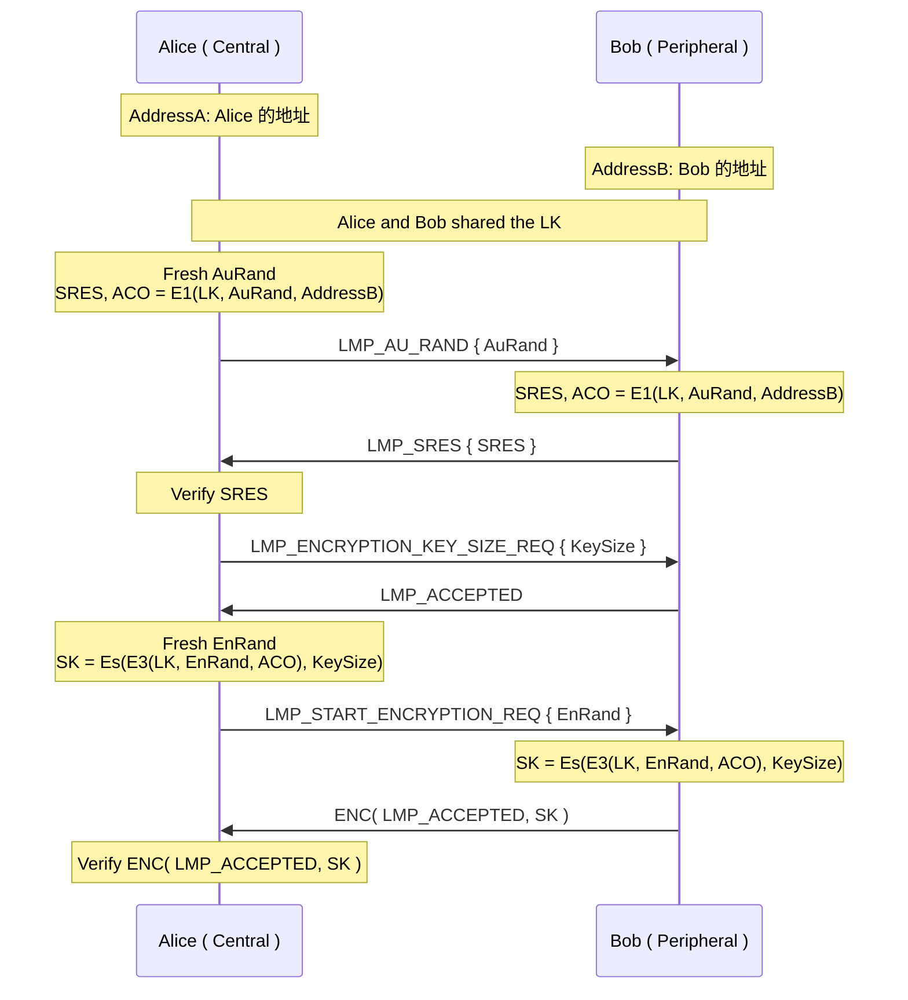
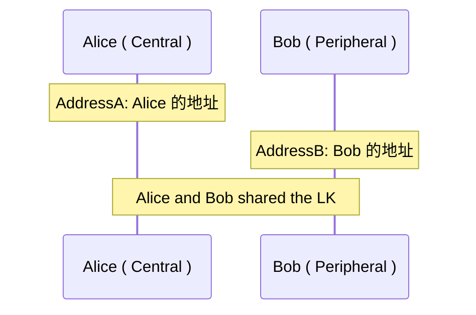
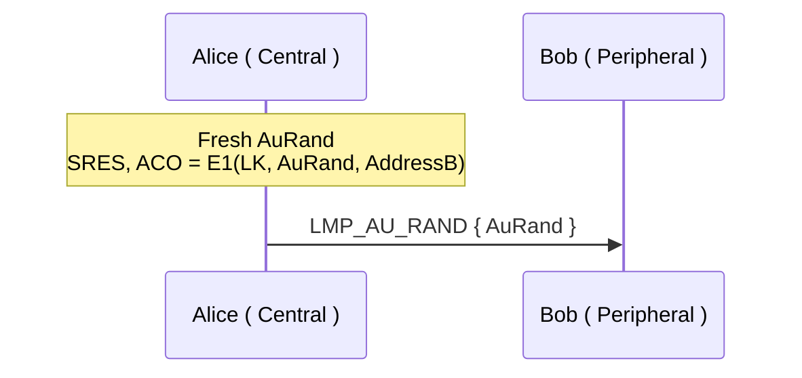
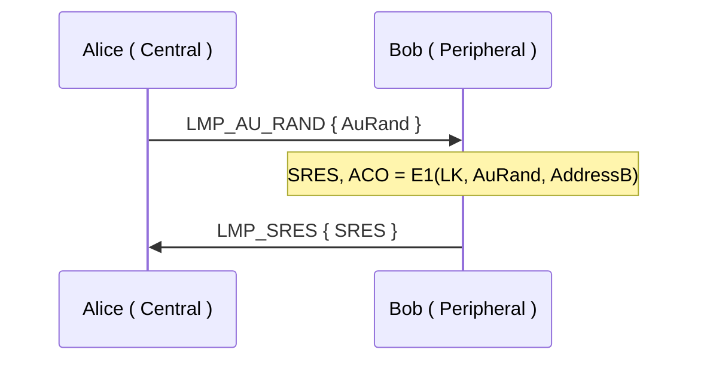
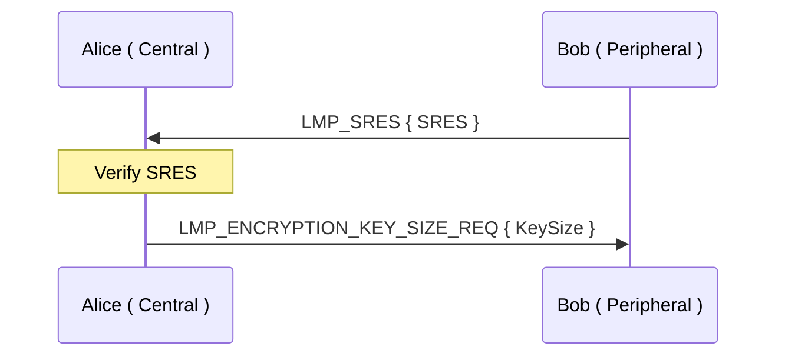
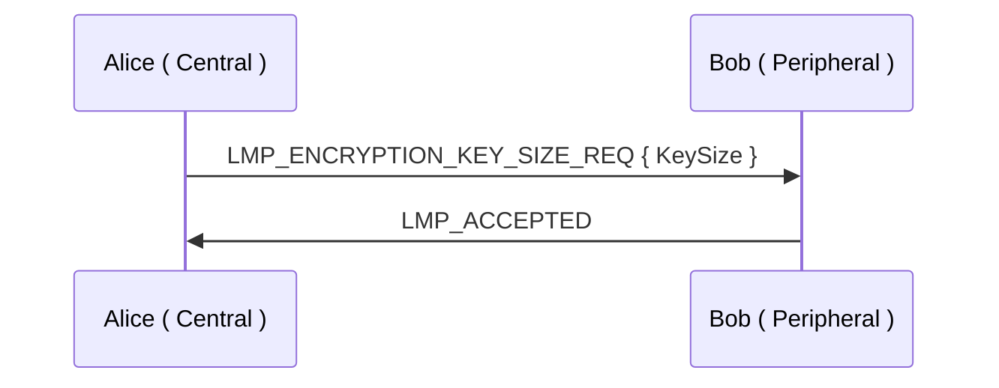
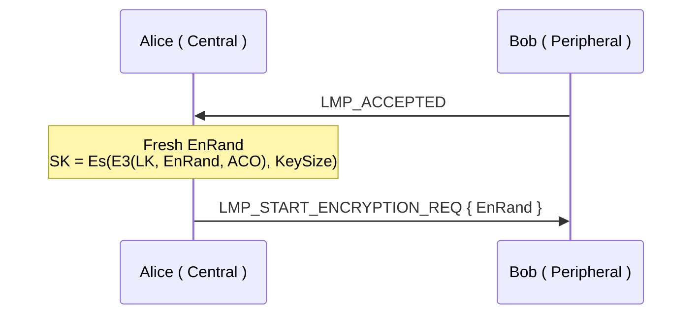
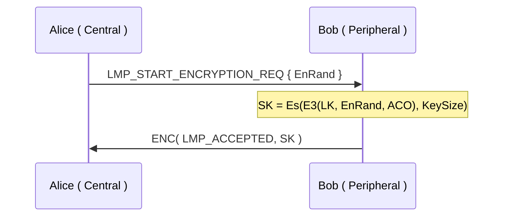
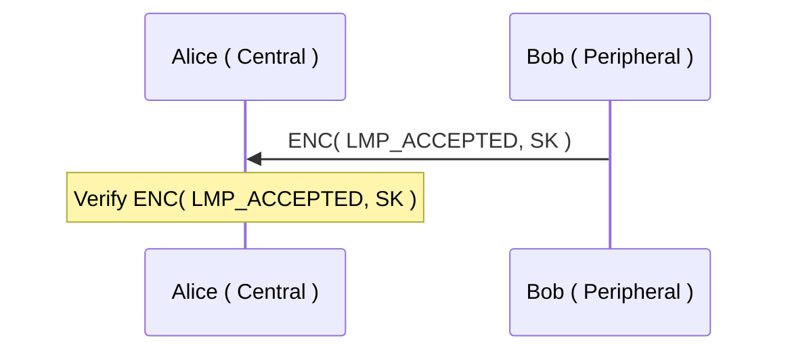

# BC Legacy Session Establishment

## Sequence

## Facts & Rules

### R_0: [] => S_0

* **Rule Name:** `InitDevices`
* **Facts In**
* **Facts  Out**
  * **S_0:** `!PairedDevices($A, $B, ~LK)`
* **Only Once**

### R_A1: S_0=> S_A1

* **Rule Name:** `CenSendAuRand`
* **Facts In**
  * **S_0:** `!PairedDevices($A, $B, LK)`
* **Facts  Out**
  * **Out:** `Out($A, $B, 'AU_RAND', AuRand)`
  * **S_A1:** `State_CenSendAuRand($A, $B, LK, SRES, ACO)`
  
### R_B1: S_0 => S_B1

* **Rule Name:** `PerRecvAuRand`
* **Facts In**
  * **In:** `In($A, $B, 'AU_RAND', AuRand)`
  * **S_0:** `!PairedDevices($A, $B, LK)`

* **Facts Out**
  * **Out:** `Out($B, $A, 'SERS', SERS)`
  * **S_B1：** `State_PerRecvAuRand($B, $A, LK, ACO)`

### R_A2: S_A1 => S_A2

* **Rule Name:** `CenNegotiateKeysize`
* **Facts In**
  * **In:** `In($B, $A, 'SERS', SERS_B)`
  * **S_A1:** `State_CenSendAuRand($A, $B, LK, SRES, ACO)`
* **Facts Out**
  * **Out:** `Out($A, $B, 'KEYSIZE', '16')`
  * **S_A2:** `State_CenNegotiateKeysize($A, $B, LK, ACO, '16')`

### R_B2: S_B1 => S_B2

* **Rule Name:** `PerNegotiateKeysize`
* **Facts In**
  * **In:** `In($A, $B, 'KEYSIZE', keysize)`
  * **S_B1:** `State_PerRecvAuRand($B, $A, LK, ACO)`
* **Facts Out**
  * **Out:** `Out($B, $A, 'ACCEPTED')`
  * **S_B2:** `State_PerNegotiateAccept($B, $A, LK, ACO, keysize)`

### R_A3: S_A2 => S_A3

* **Rule Name:** `CenStartEnc`
* **Facts In**
  * **In:** `In($B, $A, 'ACCEPTED')`
  * **S_A2 :** `State_CenNegotiateKeysize($A, $B, LK, ACO, keysize)`
* **Facts Out**
  * **Out:** `Out($A, $B, 'EN_RAND', EnRand)`
  * **S_A2:** `State_CenStartEnc($A, $B, LK, ACO, keysize, SK)`

### R_B3: S_B2 => S_B3

* **Rule Name:** `PerStartEnc`
* **Facts In**
  * **In:** `In($A, $B, 'EN_RAND', EnRand)`
  * **S_B2:** `State_PerNegotiateAccept($B, $A, LK, ACO, keysize)`
* **Facts Out**
  * **Out:** `Out($B, $A, 'ENC_ACCEPTED', senc('ACCEPTED', SK))`
  * **S_B3:** `State_PerNegotiateAccept($B, $A, LK, ACO, keysize, SK)`

### R_A4: S_A3 => S_A4

* **Rule Name:** `CentSessionEstablished`
* **Facts In**
  * **In:** `In($B, $A, 'ENC_ACCEPTED', senc('ACCEPTED', SK))`
  * **S_A3 :** `State_CenStartEnc($A, $B, LK, ACO, keysize, SK)`
* **Facts Out**
